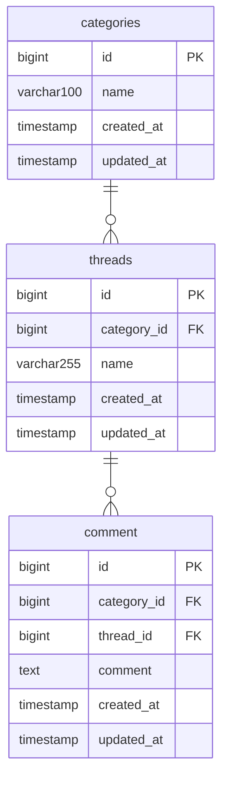

```mermaid
erDiagram
    categories ||--o{ threads : ""
    threads ||--o{ comment : ""

    categories {
        bigint id PK
        varchar100 name
        timestamp created_at
        timestamp updated_at
    }

    threads {
        bigint id PK
        bigint category_id FK
        varchar255 name
        timestamp created_at
        timestamp updated_at
    }

    comment {
        bigint id PK
        bigint category_id FK
        bigint thread_id FK
        text comment
        timestamp created_at
        timestamp updated_at
    }

```
